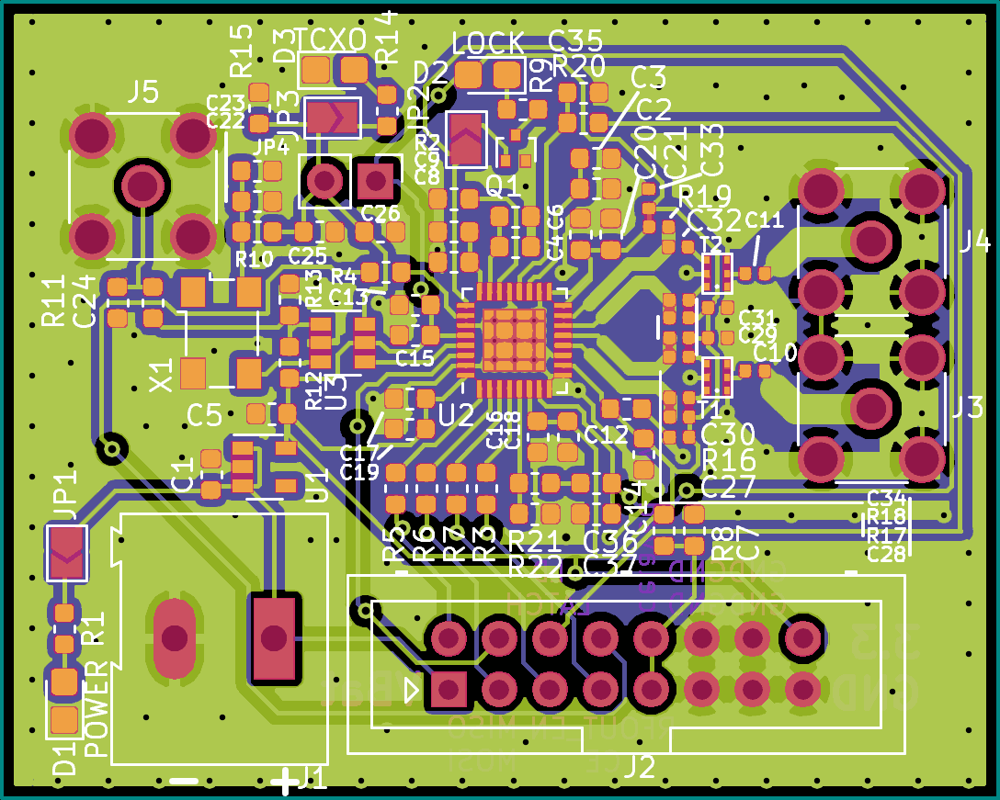

# MiniSynth

A small, MAX2870-based synthesizer with integrated oscillator or selectable
external reference clock input.

Done in KiCad.

Central components:

* Maxim MAX2870: Fractional-N Synthesizer
* Anaren B0430J50100AHF: Wideband Balun to convert MAX2870's differential output(s) to single-ended
* FOX924B: 16 MHz Oscillator
* The tears of a million coffee beans
